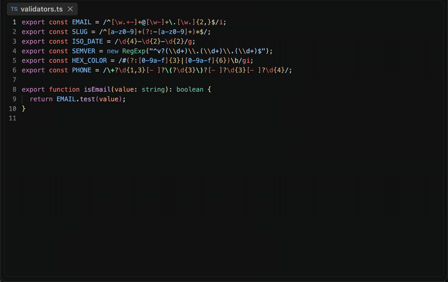

<p align="center">
  
</p>
<h1 align="center">Regex-LE: Zero Hassle Regex Extraction & Validation</h1>
<p align="center">
  <b>Find, test, and validate the regex patterns in the current file</b><br/>
  <i>Literal patterns, RegExp constructors, ReDoS screening</i>
</p>

<p align="center">
  <a href="https://marketplace.visualstudio.com/items?itemName=nolindnaidoo.regex-le">
    
  </a>
  <a href="https://open-vsx.org/extension/OffensiveEdge/regex-le">
    
  </a>
  <a href="https://www.npmjs.com/package/regex-le-mcp">
    
  </a>
  <a href="https://letools.dev/tools/regex-le">
    
  </a>
</p>

---

<p align="center">
  
</p>

> **Useful?** A star or rating is how other developers find it —
> [★ GitHub](https://github.com/nolindnaidoo/regex-le) ·
> [★ Open VSX](https://open-vsx.org/extension/OffensiveEdge/regex-le/reviews) ·
> [★ Marketplace](https://marketplace.visualstudio.com/items?itemName=nolindnaidoo.regex-le&ssr=false#review-details)

## What it does

Open any file and run one of three commands. **Extract** lists every regex pattern found in the document. **Test** (`Ctrl+Alt+R` / `Cmd+Alt+R`) runs a found — or manually entered — pattern against the file content and reports matches with real line/column positions and capture groups (named groups included). **Validate** checks every found pattern for syntax errors and screens it for ReDoS-prone shapes. Works in VS Code and VS Code–based editors like Cursor and VSCodium (installable from Open VSX).

## Use it from an AI agent

The same engine runs as an [MCP](https://modelcontextprotocol.io) server, so an agent can call it directly instead of you running a command.

| Editor | How |
|---|---|
| **VS Code** 1.101+ | Nothing to install — the extension registers `extract_patterns` with agent mode |
| **Zed** | No listing yet — [add the MCP server by hand](https://zed.dev/docs/ai/mcp) |
| **Claude Code** | `claude mcp add regex-le -- npx -y regex-le-mcp` |
| **Cursor, Windsurf, anything else** | point it at `npx regex-le-mcp` |

```
extract_patterns(content, format?, filename?, maxResults?)
```

Returns every pattern with its flags, 1-based position and a **ReDoS verdict**, so "are any of the regexes in this file dangerous?" is one call rather than two.

The server takes content and returns data — it reads no files and makes no network requests of its own. Published as [`regex-le-mcp`](https://www.npmjs.com/package/regex-le-mcp) on npm and as `io.github.nolindnaidoo/regex-le` in the [MCP registry](https://registry.modelcontextprotocol.io).

<details>
<summary><b>Configuring it by hand</b> — any host with an MCP config file</summary>

Most hosts read a JSON config. Add one entry:

```json
{
  "mcpServers": {
    "regex-le": {
      "command": "npx",
      "args": ["-y", "regex-le-mcp"]
    }
  }
}
```

`-y` skips the install prompt on first run. Pin a version if you would rather not track releases — `regex-le-mcp@2.2.1`.

Prefer not to go through `npx` on every launch? Install it once and point at the binary instead:

```bash
npm install -g regex-le-mcp
```

```json
{
  "mcpServers": {
    "regex-le": { "command": "regex-le-mcp" }
  }
}
```

It speaks MCP over stdio and needs no environment variables, no API key and no configuration of its own. To check it before wiring it into anything:

```bash
echo '{"jsonrpc":"2.0","id":1,"method":"tools/list"}' | npx -y regex-le-mcp
```

That prints the tool list and exits — if you see `extract_patterns`, the server works.

</details>

## What gets extracted

Extraction scans the whole document, so constructors split across lines are found too. The document's language chooses which spellings to look for:

| Language | Form | Example |
|---|---|---|
| JavaScript, TypeScript, Ruby | Literal | `/[a-z]+/gi` |
| JavaScript, TypeScript | Constructor | `new RegExp('\\d{4}-\\d{2}', 'g')` — including multiline |
| JavaScript, TypeScript | Bare constructor call | `RegExp("x\|y", "i")` |
| Python | `re.compile` and friends | `re.compile(r'(a+)+')` |
| Rust | `Regex::new`, `RegexBuilder::new` | `Regex::new(r"(a+)+")` |
| Go | `regexp.MustCompile`, `regexp.Compile` | ``regexp.MustCompile(`(a+)+`)`` |
| Java | `Pattern.compile`, `Pattern.matches` | `Pattern.compile("(a+)+")` |
| Ruby | `Regexp.new` | `Regexp.new('(a+)+')` |
| PHP | `preg_match` and friends | `preg_match('/(a+)+/i', $s)` |
| C# | `new Regex(…)`, `Regex.IsMatch` and friends | `new Regex(@"(a+)+")` |

A language nothing recognises is not a refusal — every spelling above is looked for. Naming it buys precision: a Python file is not scanned for bare `/…/`, so `#!/usr/bin/env python` stops reading as a pattern.

What is deliberately **not** extracted:

- Division, dates, and filesystem paths (`a / b`, `10/29/2025`, `/usr/local/bin`): a `/` preceded by an identifier, number, `)`, `]`, `.`, or another `/` is not treated as a regex — after keywords like `return`, it is. That question is only asked where a bare `/…/` is legal.
- Candidates that are not a well-formed regular expression in any of these languages, or with invalid/duplicate flags. Another language's spelling is not a syntax error: `re.compile(r'(?P<word>\w+)+@')` is reported as written, and still flagged.
- Constructor calls whose pattern argument is a variable or template literal (only literal string arguments are visible to a text scanner).
- Flags, on anything but a JavaScript literal or constructor: every other language sets them with constants, builder methods or an inline `(?i)` rather than a string argument.

Duplicate pattern+flags pairs are listed once. This is lexing by heuristic, not a parser for nine languages: a slash inside a string or comment can still be picked up when its context looks expression-like.

## ReDoS screening

`Validate` (and `Test`, before running a risky pattern) screens for the common catastrophic-backtracking shapes:

- **High severity** — nested unbounded quantifiers: `(a+)+`, `([a-z]+)*`
- **Medium severity** — quantified alternation with overlapping branches: `(a|ab)+`

This is a structural scanner, not an automaton analysis: it cannot prove a pattern safe, only flag the dangerous shapes it recognizes. The reports also include a rough performance score based on execution time relative to input size — treat it as a hint, not a benchmark (memory is not measured).

## The CLI

The same lint runs from a terminal or a shell pipeline: a Rust CLI in
[`crate/`](crate/README.md), sharing one corpus with the extension —
[`crate/fixtures/`](crate/fixtures/) — so the two can never read a
document differently.

```bash
regex-le .                      # every vulnerable pattern in the tree
regex-le --severity high src/   # only the exponential shapes
regex-le --all src/             # every pattern, vulnerable or not
regex-le mcp                    # the same lint over MCP on stdio
```

**Exit codes**: 0 nothing vulnerable, 1 at least one finding, 2 the
question was malformed — so `regex-le . || exit 1` is a CI gate.

**It ports the lint half, not the tester.** Running a pattern against
your text with JavaScript semantics needs a JavaScript engine, and
getting it nearly right would mean the two frontends reporting different
matches for the same pattern. Testing is an editor activity; keep it
here. The lint needs no engine at all — the ReDoS verdict reads the
pattern text — which is what makes it a cheap deterministic CI step.

It flags shapes and **cannot prove a pattern safe**, exactly as the
screening in this extension cannot.

Install it with `cargo install regex-le`
([crates.io](https://crates.io/crates/regex-le)). The spec
([`crate/SPEC.md`](crate/SPEC.md)) and the engineering standard
([`crate/AGENTS.md`](crate/AGENTS.md)) live alongside it, and it keeps
its own [CHANGELOG](crate/CHANGELOG.md).

**Two MCP servers, one tool.** `regex-le mcp` offers `extract_patterns`
exactly as [`regex-le-mcp`](https://www.npmjs.com/package/regex-le-mcp)
does — [`crate/fixtures/mcp-extract-patterns.json`](crate/fixtures/mcp-extract-patterns.json)
runs against both and CI fails if they diverge. Take the npm one if Node
is already there; take the binary if you want no runtime, or if you want
`regex_le_lint` too.

## Commands

| Command | Description |
|---|---|
| `Regex-LE: Test Regex` (`Ctrl+Alt+R` / `Cmd+Alt+R`) | Test a found or entered pattern against the file |
| `Regex-LE: Extract Patterns` | List every regex pattern found in the document |
| `Regex-LE: Validate Regex` | Syntax + ReDoS report for every found pattern |
| `Regex-LE: Open Settings` | Open Regex-LE settings |
| `Regex-LE: Help & Troubleshooting` | Built-in documentation |

## Settings

| Setting | Default | Description |
|---|---|---|
| `regex-le.openResultsSideBySide` | `true` | Open results beside the current editor |
| `regex-le.copyToClipboardEnabled` | `false` | Also copy results to the clipboard |
| `regex-le.notificationsLevel` | `silent` | `all` = every notification, `important` = warnings + errors, `silent` = errors only |
| `regex-le.safety.enabled` | `true` | Guardrails for very large files and outputs |
| `regex-le.safety.fileSizeWarnBytes` | `1000000` | Refuse processing above this file size |
| `regex-le.safety.largeOutputLinesThreshold` | `50000` | Refuse result documents above this line count |
| `regex-le.statusBar.enabled` | `true` | Show the status bar item |
| `regex-le.telemetryEnabled` | `false` | Local-only event log (see Privacy) |
| `regex-le.regex.redosDetectionEnabled` | `true` | ReDoS screening in Test/Validate |
| `regex-le.regex.maxMatchLimit` | `1000` | Cap on matches collected per test (10–10000) |

## Languages

Twelve languages besides English:

German · Spanish · French · Indonesian · Italian · Japanese · Korean ·
Portuguese (Brazil) · Russian · Ukrainian · Vietnamese · Chinese (Simplified)

Both halves are covered — the manifest (command titles, setting names and
descriptions) and everything shown while the extension runs (notifications,
the status bar, quick-picks and prompts). The extension follows VS Code's
display language, so it matches whatever the editor is already set to; no
setting of its own.

## Privacy & security

- **No network access.** The extension never sends data anywhere. The `telemetryEnabled` setting only writes events to a local Output Channel you can inspect (`Regex-LE Telemetry`).
- Testing a pattern the ReDoS screen rates high-severity asks for confirmation first.
- **The MCP server holds the same line.** It takes content as an argument and returns data: no filesystem access, no network calls, no telemetry. Your agent already has file-read tools, so duplicating them inside the server would add a path-traversal surface for no capability. `check:mcp-bundle` fails the build if the server ever imports something that could reach either.
- Error notifications redact home directories and credential-shaped fragments.

## Development

```bash
bun install
bun run build            # esbuild bundle -> dist/extension.js
bun run typecheck        # tsc --noEmit (includes tests)
bun run test             # vitest unit suite
bun run test:integration # real VS Code extension host
bun run lint             # biome
bun run package          # VSIX into release/
```

Architecture and conventions live in [AGENTS.md](AGENTS.md). Changes are tracked in [CHANGELOG.md](CHANGELOG.md).

## Performance

<!-- performance:start -->
| Input | Size | Found | Time | Rate | Scan speed |
| --- | --- | --- | --- | --- | --- |
| JS with literals | 1.12 MB | 25,000 | 44.19 ms | 565,679/sec | 25.4 MB/s |
| JS with constructors | 1.27 MB | 25,000 | 41.86 ms | 597,268/sec | 30.3 MB/s |
| Source without regexes | 1.24 MB | 0 | 18.75 ms | — | 66 MB/s |

Median of 7 runs after warmup, on Apple M5 Pro, 24 GB RAM, Node 24.3.0. Inputs are generated
by `scripts/benchmark.ts` rather than checked in, so the sizes above are
exactly what was measured. Reproduce with `bun run benchmark`.

These are machine-specific and are not asserted in CI — a benchmark that gates
a build only tells you how busy the runner was.
<!-- performance:end -->

## Testing

<!-- coverage:start -->
| Metric | Coverage |
| --- | --- |
| Statements | 91.27% |
| Branches | 77.68% |
| Functions | 97.74% |
| Lines | 91.68% |

153 test cases across 14 files, plus an integration suite that runs
in a real VS Code extension host and an end-to-end test that installs the
built `.vsix` into a clean profile.

Generated from `coverage/coverage-summary.json` by
`scripts/coverage-readme.js`; CI fails if this section drifts from a fresh
run. Reproduce with `bun run test:coverage`.
<!-- coverage:end -->

## More from the LE family

Sixteen single-purpose tools for the work in front of every model. Each ships
a Rust CLI and an MCP server. One page: **[letools.dev](https://letools.dev)**

**Get it out**

- **[String-LE](https://letools.dev/tools/string-le)** — Extract every string in a codebase, with its position, so a person can read them
- **[Numbers-LE](https://letools.dev/tools/numbers-le)** — Extract every hardcoded number in a codebase, so a person can check them
- **[Units-LE](https://letools.dev/tools/units-le)** — Extract every quantity with its unit, normalized, and refuse the ambiguous ones by name
- **[Dates-LE](https://letools.dev/tools/dates-le)** — Extract every date and timestamp, and the exact instant each one resolves to
- **[IDs-LE](https://letools.dev/tools/ids-le)** — Extract every UUID, ULID, NanoID, ObjectId and Snowflake, and decode the time inside
- **[IPs-LE](https://letools.dev/tools/ips-le)** — Extract every IP address, CIDR block and MAC, normalized and classified by scope
- **[URLs-LE](https://letools.dev/tools/urls-le)** — Extract every URL in a codebase, with its protocol and exact position
- **[Paths-LE](https://letools.dev/tools/paths-le)** — Extract every file path in a codebase, and say whether it still points at anything
- **[Colors-LE](https://letools.dev/tools/colors-le)** — Extract every color in a codebase, and say which ones are not in your palette

**Check it**

- **[Regex-LE](https://letools.dev/tools/regex-le)** — Find every regex in a codebase, and report which can be driven into catastrophic backtracking
- **[Versions-LE](https://letools.dev/tools/versions-le)** — Find where one dependency is constrained differently across a repository's manifests
- **[i18n-LE](https://letools.dev/tools/i18n-le)** — Identify the i18n library a project uses, then audit its catalogs by that library's rules
- **[Scrape-LE](https://letools.dev/tools/scrape-le)** — Check whether a page is scrapeable before the scraper is written, and say when it cannot tell

**Guard it**

- **[Secrets-LE](https://letools.dev/tools/secrets-le)** — Find hardcoded credentials in a codebase, and never print one into the report
- **[EnvSync-LE](https://letools.dev/tools/envsync-le)** — Compare the dotenv files in a tree, and say which keys are missing from which
- **[Unicode-LE](https://letools.dev/tools/unicode-le)** — Find the Unicode that hides meaning — bidi controls, invisibles, homoglyphs, mixed scripts

Each stands on its own: no shared crate, no published core. Where two of them
agree, it is because the same answer was right twice.

**Contact** — [nolindnaidoo.com](https://nolindnaidoo.com) · [GitHub](https://github.com/nolindnaidoo) · [LinkedIn](https://www.linkedin.com/in/nolindnaidoo/)
## Also by nolindnaidoo

**Rust** — pixelcoords and pixelactions are one loop: pixelcoords answers
*where*, pixelactions *acts* there. Their own tools, their own voice — not
part of the LE family.

- **[pixelcoords](https://github.com/nolindnaidoo/pixelcoords)** — Freeze your screen, mark regions, get pixel-exact coordinates and crops
  [pixelcoords.dev](https://pixelcoords.dev) · [crates.io](https://crates.io/crates/pixelcoords) · [docs.rs](https://docs.rs/pixelcoords)
- **[pixelactions](https://github.com/nolindnaidoo/pixelactions)** — Consume human-verified coordinates, perform the interaction, confirm it landed
  [pixelactions.dev](https://pixelactions.dev) · [crates.io](https://crates.io/crates/pixelactions) · [docs.rs](https://docs.rs/pixelactions)

## License

MIT © [nolindnaidoo](https://github.com/nolindnaidoo)
