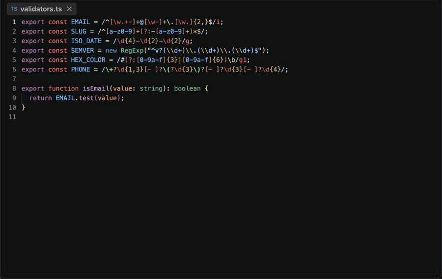

<p align="center">
  
</p>
<h1 align="center">Regex-LE: Zero Hassle Regex Extraction & Validation</h1>
<p align="center">
  <b>Find, test, and validate the regex patterns in the current file</b><br/>
  <i>Literal patterns, RegExp constructors, ReDoS screening</i>
</p>

<p align="center">
  <a href="https://marketplace.visualstudio.com/items?itemName=nolindnaidoo.regex-le">
    
  </a>
  <a href="https://open-vsx.org/extension/nolindnaidoo/regex-le">
    
  </a>
  <a href="https://www.npmjs.com/package/regex-le-mcp">
    
  </a>
  <a href="https://crates.io/crates/regex-le">
    
  </a>
  <a href="https://letools.dev/tools/regex-le">
    
  </a>
</p>

---

<p align="center">
  
</p>

> **Useful?** A star or rating is how other developers find it —
> [★ GitHub](https://github.com/nolindnaidoo/regex-le) ·
> [★ Open VSX](https://open-vsx.org/extension/nolindnaidoo/regex-le/reviews) ·
> [★ Marketplace](https://marketplace.visualstudio.com/items?itemName=nolindnaidoo.regex-le&ssr=false#review-details)

## What it does

Open any file and run one of three commands. **Extract** lists every regex pattern found in the document. **Test** runs a found — or manually entered — pattern against the file content and reports matches with real line/column positions and capture groups (named groups included). **Validate** checks every found pattern for syntax errors and screens it for catastrophic backtracking, reporting the input that causes it. Works in VS Code and VS Code–based editors like Cursor and VSCodium (installable from Open VSX).

## Install

| Where | What you get | Install |
|---|---|---|
| **VS Code** | The lint *and* the tester, in your editor | [Marketplace](https://marketplace.visualstudio.com/items?itemName=nolindnaidoo.regex-le) |
| **Cursor, VSCodium, Windsurf** | The same extension | [Open VSX](https://open-vsx.org/extension/nolindnaidoo/regex-le) |
| **A terminal or a CI step** | The same run over a whole tree, with exit codes | `cargo install regex-le` · [crates.io](https://crates.io/crates/regex-le) |
| **Any MCP agent, via Node** | `extract_patterns` over stdio | `npx regex-le-mcp` · [npm](https://www.npmjs.com/package/regex-le-mcp) |

## Use it from an AI agent

The same engine runs as an [MCP](https://modelcontextprotocol.io) server, so an agent can call it directly instead of you running a command.

| Editor | How |
|---|---|
| **VS Code** 1.101+ | Nothing to install — the extension registers `extract_patterns` with agent mode |
| **Claude Code** | `claude mcp add regex-le -- npx -y regex-le-mcp` |
| **Cursor, Windsurf, anything else** | point it at `npx regex-le-mcp` |

```
extract_patterns(content, format?, filename?, maxResults?)
```

Returns every pattern with its flags, 1-based position and a **ReDoS verdict**, so "are any of the regexes in this file dangerous?" is one call rather than two. A verdict that reports a blow-up carries the `witness` that caused it, so an agent can check the finding instead of trusting it.

The server takes content and returns data — it reads no files and makes no network requests of its own. Published as [`regex-le-mcp`](https://www.npmjs.com/package/regex-le-mcp) on npm and as `io.github.nolindnaidoo/regex-le` in the [MCP registry](https://registry.modelcontextprotocol.io).

<details>
<summary><b>Configuring it by hand</b> — any host with an MCP config file</summary>

Most hosts read a JSON config. Add one entry:

```json
{
  "mcpServers": {
    "regex-le": {
      "command": "npx",
      "args": ["-y", "regex-le-mcp"]
    }
  }
}
```

`-y` skips the install prompt on first run. Pin a version if you would rather not track releases — `regex-le-mcp@2.6.0`.

Prefer not to go through `npx` on every launch? Install it once and point at the binary instead:

```bash
npm install -g regex-le-mcp
```

```json
{
  "mcpServers": {
    "regex-le": { "command": "regex-le-mcp" }
  }
}
```

It speaks MCP over stdio and needs no environment variables, no API key and no configuration of its own. To check it before wiring it into anything:

```bash
echo '{"jsonrpc":"2.0","id":1,"method":"tools/list"}' | npx -y regex-le-mcp
```

That prints the tool list and exits — if you see `extract_patterns`, the server works.

</details>

## What gets extracted

Extraction scans the whole document, so constructors split across lines are found too. The document's language chooses which spellings to look for:

| Language | Form | Example |
|---|---|---|
| JavaScript, TypeScript, Ruby | Literal | `/[a-z]+/gi` |
| JavaScript, TypeScript | Constructor | `new RegExp('\\d{4}-\\d{2}', 'g')` — including multiline |
| JavaScript, TypeScript | Bare constructor call | `RegExp("x\|y", "i")` |
| Python | `re.compile` and friends | `re.compile(r'(a+)+')` |
| Rust | `Regex::new`, `RegexBuilder::new` | `Regex::new(r"(a+)+")` |
| Go | `regexp.MustCompile`, `regexp.Compile` | ``regexp.MustCompile(`(a+)+`)`` |
| Java | `Pattern.compile`, `Pattern.matches` | `Pattern.compile("(a+)+")` |
| Ruby | `Regexp.new` | `Regexp.new('(a+)+')` |
| PHP | `preg_match` and friends | `preg_match('/(a+)+/i', $s)` |
| C# | `new Regex(…)`, `Regex.IsMatch` and friends | `new Regex(@"(a+)+")` |

A language nothing recognises is not a refusal — every spelling above is looked for. Naming it buys precision: a Python file is not scanned for bare `/…/`, so `#!/usr/bin/env python` stops reading as a pattern.

What is deliberately **not** extracted:

- Division, dates, and filesystem paths (`a / b`, `10/29/2025`, `/usr/local/bin`): a `/` preceded by an identifier, number, `)`, `]`, `.`, or another `/` is not treated as a regex — after keywords like `return`, it is. That question is only asked where a bare `/…/` is legal.
- Candidates that are not a well-formed regular expression in any of these languages, or with invalid/duplicate flags. Another language's spelling is not a syntax error: `re.compile(r'(?P<word>\w+)+@')` is reported as written, and still flagged.
- Constructor calls whose pattern argument is a variable, or a template literal with a `${…}` substitution. String literals, static template literals and `` String.raw`…` `` are read.
- Flags, on anything but a JavaScript literal or constructor: every other language sets them with constants, builder methods or an inline `(?i)` rather than a string argument.
- **Anything written in a comment or a string.** A JSDoc block explaining a hazard, a commented-out line, a Python docstring with an example — none of them is code, and reporting one fails a build over a sentence. The rule is about where a candidate *starts*, so `re.compile(r"(a+)+b")` keeps its quoted argument while a docstring holding that whole line is prose. Only when the language is known: a document nothing recognises is scanned as written, because a comment rule guessed from the wrong grammar would drop real patterns instead of phantom ones.

Duplicate pattern+flags pairs are listed once. This is lexing by heuristic, not a parser for nine languages: a slash inside a string can still be picked up when its context looks expression-like.

## ReDoS screening

`Validate` (and `Test`, before running a risky pattern) reports a pattern **only when an input was found that demonstrably drives it into catastrophic backtracking** — and reports that input alongside it, as the `witness`.

Your pattern is never run. It is compiled to an automaton, and that automaton is walked the way a backtracking engine walks one — depth-first, every edge in order, a dead end unwound rather than remembered — while the steps are counted. An attack string is built, pumped at two lengths, and measured against a step budget. So a finding is falsifiable: run the witness and watch.

Nothing is reported on the strength of how a pattern is *shaped*. Shape is a poor predictor in both directions: `^[a-z0-9]+(?:-[a-z0-9]+)*$` looks dangerous and is not, because every iteration must eat a `-` the inner class cannot produce, while `(.*a){20}` looks bounded and is not. A separator forcing the split is a fact about strings, so no test on syntax settles it.

**Silence is not a clearance.** A pattern this cannot read — a backreference, lookaround, syntax it does not parse — comes back as `not decided: <reason>`, never as safe.

The reports also include a rough performance score based on execution time relative to input size — treat it as a hint, not a benchmark (memory is not measured).

## Across a folder or a workspace

Extract and Validate read the document you have open. Each has a form that reads many files from disk and gives one report.

- **The whole workspace**: run `Regex-LE: Extract Patterns from Workspace` or `Regex-LE: Validate Patterns in Workspace` from the command palette.
- **One folder**: right-click it in the Explorer and choose `Extract Patterns from Folder` or `Validate Patterns in Folder`. The same two commands in the palette ask for a folder.

### Extract

A project writes the same pattern in many places, so the report is the distinct patterns and where each one is, the most widely used first:

```markdown
# Regex-LE workspace report

`my-project` · 3 file(s) read · 3 distinct pattern(s) in 3 file(s)

| Pattern | Files |
|---|---|
| `/\d+/g` | 2 |
| `/\d+/` | 1 |
| `/^x$/` | 1 |

## `/\d+/g` (2)

- `src/a.ts` · **1:11**
- `src/b.ts` · **1:11**

## `/\d+/` (1)

- `src/c.py` · **2:5**

## `/^x$/` (1)

- `src/a.ts` · **2:11**
```

Two patterns are the same when their text and flags are, so `/\d+/g` and `/\d+/` are listed apart. A pattern is counted once per file, at the first place it is written there.

### Validate

The report opens with a table of the files that hold something to look at, then lists the patterns that can hang:

```markdown
# Regex-LE workspace report

`my-project` · 3 file(s) read · 5 pattern(s), 1 can hang, 1 not checked

| File | Patterns | Can hang | Not checked |
|---|---|---|---|
| `src/a.ts` | 2 | 1 | 0 |
| `src/b.py` | 2 | 0 | 1 |

> 1 other file(s) hold only patterns with no finding.

## `src/a.ts` (1)

- **2:14** · `/(a+)+$/` · can hang (high): exponential backtracking: 2000000 steps on 41 characters, against 229328 on 20 · complexity 0/100
```

**Can hang** means an input was found that drives the pattern into backtracking, the same search [ReDoS screening](#redos-screening) describes. **Not checked** means the search could not answer for the pattern either way, because it uses a backreference or a lookaround. That is not a verdict on the pattern, and the report gives the reason.

A pattern written for another language's engine is read, not refused: a Python `(?P<year>\d{4})`, an atomic group or a possessive quantifier is searched like any other.

Only the patterns that can hang are listed. The rest are counted per file, and `regex-le.workspace.scanIncludePassing` lists every one with what was found. `regex-le.workspace.scanProblemsEnabled` also puts the ones that can hang in the Problems panel, where each is a line you can click.

**What a scan reads.** Source files in the nine languages the extractor knows: JavaScript, TypeScript, Python, Rust, Go, Java, Ruby, PHP and C#. Any other file would be searched for every spelling of a pattern at once, and a path in a README reads as one. `scanPatterns` widens that. Files come from disk, so an unsaved edit is not seen. A file over the safety size, or one that is not UTF-8 text, is left unread. It stops at 5,000 files or 10,000 listed patterns. The report ends with a line for each thing it left out, so a short report is never mistaken for a clean project.

**What it skips, and how to change that.** Three switches are on by default, and each can be turned off on its own in Settings:

| Switch | Skips |
|---|---|
| `scanUseDefaultExcludes` | Dependency folders, build output, tool caches and lockfiles. The full list is below |
| `scanRespectGitignore` | Whatever the project's `.gitignore` files skip |
| `scanSkipBinaryFiles` | Images, fonts, archives and other files that are not text |

Two lists adjust the result without turning a switch off. To skip more, add a pattern to `scanExcludes`. To read something a switch would skip, add it to `scanAlwaysInclude`:

```jsonc
{
	// Also skip the test fixtures.
	"regex-le.workspace.scanExcludes": ["**/fixtures/**"],
	// Read the vendored code, though the built-in list skips it.
	"regex-le.workspace.scanAlwaysInclude": ["**/vendor/**"]
}
```

`Regex-LE: Open Settings` opens all of these in the Settings editor.

<details>
<summary>The built-in list</summary>

Folders, wherever they appear:

<!-- built-in-folders -->
`.git`, `.hg`, `.svn`, `node_modules`, `bower_components`, `jspm_packages`, `.pnpm-store`, `.yarn`, `vendor`, `site-packages`, `Pods`, `Carthage`, `dist`, `build`, `out`, `target`, `_build`, `_site`, `dist-newstyle`, `zig-out`, `storybook-static`, `cdk.out`, `DerivedData`, `CMakeFiles`, `.next`, `.nuxt`, `.output`, `.svelte-kit`, `.angular`, `.astro`, `.docusaurus`, `.vuepress`, `.expo`, `.turbo`, `.parcel-cache`, `.cache`, `.sass-cache`, `.jekyll-cache`, `.dart_tool`, `.pub-cache`, `.gradle`, `.kotlin`, `.cxx`, `.externalNativeBuild`, `captures`, `ephemeral`, `.symlinks`, `.swiftpm`, `.build`, `.bundle`, `.stack-work`, `.zig-cache`, `.godot`, `elm-stuff`, `.vercel`, `.netlify`, `.serverless`, `.aws-sam`, `.terraform`, `.venv`, `venv`, `__pycache__`, `.tox`, `.nox`, `.mypy_cache`, `.pytest_cache`, `.ruff_cache`, `.ipynb_checkpoints`, `.eggs`, `coverage`, `htmlcov`, `.nyc_output`, `.vscode-test`, `.idea`, `.vs`, `xcuserdata`, `*.egg-info`
<!-- /built-in-folders -->

Files, wherever they appear:

<!-- built-in-files -->
`*.min.js`, `*.min.css`, `*.map`, `*.snap`, `*.lock`, `package-lock.json`, `pnpm-lock.yaml`, `npm-shrinkwrap.json`, `go.sum`, `*.pbxproj`, `*.iml`, `local.properties`, `output-metadata.json`, `.flutter-plugins`, `.flutter-plugins-dependencies`, `.packages`, `Generated.xcconfig`, `flutter_export_environment.sh`, `GeneratedPluginRegistrant.*`, `fastlane/report.xml`, `fastlane/test_output/**`, `doc/api/**`
<!-- /built-in-files -->

Not on the list, because they are ordinary folders in many projects: `bin`, `obj`, `tmp`, `logs`, `public`, `generated`. A project that generates those ignores them in git, and the scan reads `.gitignore`.

</details>

The settings that shape a scan are under [Settings](#settings). The positions settings apply to it as they do to the single-file commands.

## The CLI

The same lint runs from a terminal or a shell pipeline: a Rust CLI in
[`crate/`](crate/README.md), sharing one corpus with the extension —
[`crate/fixtures/`](crate/fixtures/) — so the two can never read a
document differently.

```bash
regex-le .                      # every vulnerable pattern in the tree
regex-le --severity high src/   # only the exponential shapes
regex-le --all src/             # every pattern, vulnerable or not
regex-le mcp                    # the same lint over MCP on stdio
```

**Exit codes**: 0 nothing vulnerable, 1 at least one finding, 2 the
question was malformed — so `regex-le . || exit 1` is a CI gate.

**It ports the lint half, not the tester.** Running a pattern against
your text with JavaScript semantics needs a JavaScript engine, and
getting it nearly right would mean the two frontends reporting different
matches for the same pattern. Testing is an editor activity; keep it
here. The lint needs no engine at all — the ReDoS verdict walks an
automaton built from the pattern text, under a step budget — which is
what makes it a cheap deterministic CI step.

It reports what it can demonstrate and **refuses what it cannot read**,
exactly as the screening in this extension does.

## Commands

| Command | Description |
|---|---|
| `Regex-LE: Test Regex` | Test a found or entered pattern against the file |
| `Regex-LE: Extract Patterns` | List every regex pattern found in the document |
| `Regex-LE: Extract Patterns from Workspace` | The distinct patterns in every source file in the workspace, and the files that hold each |
| `Regex-LE: Extract Patterns from Folder` | The same for one folder. Also on a folder in the Explorer |
| `Regex-LE: Validate Regex` | Syntax + ReDoS report for every found pattern |
| `Regex-LE: Validate Patterns in Workspace` | Every pattern in every source file in the workspace, and which can hang |
| `Regex-LE: Validate Patterns in Folder` | The same for one folder. Also on a folder in the Explorer |
| `Regex-LE: Open Settings` | Open Regex-LE settings |
| `Regex-LE: Help & Troubleshooting` | Built-in documentation |

No command is bound to a key by default. Give any of them one under **Keyboard Shortcuts** in the editor.

## Settings

| Setting | Default | Description |
|---|---|---|
| `regex-le.openResultsSideBySide` | `true` | Open results beside the current editor |
| `regex-le.showPositions` | `true` | Show the line and column of each pattern and match |
| `regex-le.copyToClipboardEnabled` | `false` | Also copy results to the clipboard |
| `regex-le.clipboardIncludesPositions` | `true` | Include the line and column in that copy |
| `regex-le.notificationsLevel` | `silent` | `all` = every notification, `important` = warnings + errors, `silent` = errors only |
| `regex-le.safety.enabled` | `true` | Guardrails for very large files and outputs |
| `regex-le.safety.fileSizeWarnBytes` | `1000000` | Refuse processing above this file size |
| `regex-le.safety.largeOutputLinesThreshold` | `50000` | Refuse result documents above this line count |
| `regex-le.statusBar.enabled` | `true` | Show the status bar item |
| `regex-le.telemetryEnabled` | `false` | Local-only event log (see Privacy) |
| `regex-le.regex.redosDetectionEnabled` | `true` | ReDoS screening in Test/Validate |
| `regex-le.regex.maxMatchLimit` | `1000` | Cap on matches collected per test (10–10000) |
| `regex-le.workspace.scanPatterns` | Source files in the nine languages | The files a folder or workspace scan reads |
| `regex-le.workspace.scanUseDefaultExcludes` | `true` | Skip dependency folders, build output, caches and lockfiles |
| `regex-le.workspace.scanRespectGitignore` | `true` | Skip what the project's `.gitignore` files skip |
| `regex-le.workspace.scanSkipBinaryFiles` | `true` | Skip images, fonts, archives and other files that are not text |
| `regex-le.workspace.scanExcludes` | `[]` | More files to skip, as glob patterns |
| `regex-le.workspace.scanAlwaysInclude` | `[]` | Files to read even when one of the three above would skip them |
| `regex-le.workspace.scanMaxFiles` | `5000` | The most files one scan reads |
| `regex-le.workspace.scanMaxResults` | `10000` | The most patterns one scan lists before it stops reading |
| `regex-le.workspace.scanIncludePassing` | `false` | In a Validate scan, list every pattern, not only the ones that can hang |
| `regex-le.workspace.scanProblemsEnabled` | `false` | In a Validate scan, also show the patterns that can hang in the Problems panel |

## Languages

Twelve languages besides English:

German · Spanish · French · Indonesian · Italian · Japanese · Korean ·
Portuguese (Brazil) · Russian · Ukrainian · Vietnamese · Chinese (Simplified)

Both halves are covered — the manifest (command titles, setting names and
descriptions) and everything shown while the extension runs (notifications,
the status bar, quick-picks and prompts). The extension follows VS Code's
display language, so it matches whatever the editor is already set to; no
setting of its own.

## Privacy & security

- **No network access.** The extension never sends data anywhere. The `telemetryEnabled` setting only writes events to a local Output Channel you can inspect (`Regex-LE Telemetry`).
- Testing a pattern the ReDoS screen rates high-severity asks for confirmation first.
- **The MCP server holds the same line.** It takes content as an argument and returns data: no filesystem access, no network calls, no telemetry. Your agent already has file-read tools, so duplicating them inside the server would add a path-traversal surface for no capability. `check:mcp-bundle` fails the build if the server ever imports something that could reach either.
- Error notifications redact home directories and credential-shaped fragments.
- **One rating prompt, at most twice.** On the 3rd successful use the extension asks once whether you would rate it, and once more on the 20th if you chose *Later* or dismissed it. *Don't Ask Again* ends it. Setting `notificationsLevel` to `important` or `silent` yourself turns it off. The counts are kept in VS Code's extension storage and nothing is sent anywhere; *Rate* opens the listing you installed from — the VS Code Marketplace or Open VSX — in your browser.

## Documentation

| What | Where |
|---|---|
| What the tool is allowed to say — scope, output contract, refusals, non-goals | [`crate/SPEC.md`](crate/SPEC.md) |
| How the extension is built and held together — architecture, invariants, toolchain, release | [AGENTS.md](AGENTS.md) |
| How the CLI is built and held together | [`crate/AGENTS.md`](crate/AGENTS.md) |
| What changed | [CHANGELOG.md](CHANGELOG.md) · [`crate/CHANGELOG.md`](crate/CHANGELOG.md) |
| The tool's page, and the other fifteen | [letools.dev/tools/regex-le](https://letools.dev/tools/regex-le) |

## Performance

<!-- performance:start -->
| Input | Size | Found | Time | Rate | Scan speed |
| --- | --- | --- | --- | --- | --- |
| JS with literals | 1.12 MB | 25,000 | 44.19 ms | 565,679/sec | 25.4 MB/s |
| JS with constructors | 1.27 MB | 25,000 | 41.86 ms | 597,268/sec | 30.3 MB/s |
| Source without regexes | 1.24 MB | 0 | 18.75 ms | — | 66 MB/s |

Median of 7 runs after warmup, on Apple M5 Pro, 24 GB RAM, Node 24.3.0. Inputs are generated
by `scripts/benchmark.ts` rather than checked in, so the sizes above are
exactly what was measured. Reproduce with `bun run benchmark`.

These are machine-specific and are not asserted in CI — a benchmark that gates
a build only tells you how busy the runner was.
<!-- performance:end -->

## Testing

<!-- coverage:start -->
| Metric | Coverage |
| --- | --- |
| Statements | 93.34% |
| Branches | 82.27% |
| Functions | 98.59% |
| Lines | 95.39% |

378 test cases across 26 files, plus an integration suite that runs
in a real VS Code extension host and an end-to-end test that installs the
built `.vsix` into a clean profile.

Generated from a real run — `coverage/coverage-summary.json` and
`coverage/test-results.json` — by `scripts/coverage-readme.js`; CI fails if
this section drifts. Reproduce with `bun run test:coverage`, and the case
count is the one vitest prints.
<!-- coverage:end -->

## More from the LE family

Sixteen single-purpose tools for the work in front of every model. Each ships
a Rust CLI and an MCP server. One page: **[letools.dev](https://letools.dev)**

**Get it out**

- **[String-LE](https://letools.dev/tools/string-le)** — Extract every string in a codebase, so a person can read them
- **[Numbers-LE](https://letools.dev/tools/numbers-le)** — Extract every hardcoded number in a codebase, so a person can check them
- **[Units-LE](https://letools.dev/tools/units-le)** — Extract every quantity with its unit, normalized, and refuse the ambiguous ones by name
- **[Dates-LE](https://letools.dev/tools/dates-le)** — Extract every date and timestamp, and the exact instant each one resolves to
- **[IDs-LE](https://letools.dev/tools/ids-le)** — Extract every UUID, ULID, NanoID, ObjectId and Snowflake, and decode the time inside
- **[IPs-LE](https://letools.dev/tools/ips-le)** — Extract every IP address, CIDR block and MAC, normalized and classified by scope
- **[URLs-LE](https://letools.dev/tools/urls-le)** — Extract every URL in a codebase, with its protocol and exact position
- **[Paths-LE](https://letools.dev/tools/paths-le)** — Extract every file path in a codebase, and say whether it still points at anything
- **[Colors-LE](https://letools.dev/tools/colors-le)** — Extract every color in a codebase, and say which ones are not in your palette

**Check it**

- **[Regex-LE](https://letools.dev/tools/regex-le)** — Find every regex in a codebase, and report which can be driven into catastrophic backtracking
- **[Versions-LE](https://letools.dev/tools/versions-le)** — Find where one dependency is constrained differently across a repository's manifests
- **[i18n-LE](https://letools.dev/tools/i18n-le)** — Identify the i18n library a project uses, then audit its catalogs by that library's rules
- **[Scrape-LE](https://letools.dev/tools/scrape-le)** — Check whether a page is scrapeable before the scraper is written, and say when it cannot tell

**Guard it**

- **[Secrets-LE](https://letools.dev/tools/secrets-le)** — Find hardcoded credentials in a codebase, and never print one into the report
- **[EnvSync-LE](https://letools.dev/tools/envsync-le)** — Compare the dotenv files in a tree, and say which keys are missing from which
- **[Unicode-LE](https://letools.dev/tools/unicode-le)** — Find the Unicode that hides meaning — bidi controls, invisibles, homoglyphs, mixed scripts

Each stands on its own: no shared crate, no published core. Where two of them
agree, it is because the same answer was right twice.

**Contact** — [nolindnaidoo.com](https://nolindnaidoo.com) · [GitHub](https://github.com/nolindnaidoo) · [LinkedIn](https://www.linkedin.com/in/nolindnaidoo/)

## Also by nolindnaidoo

**Rust** — pixelcoords and pixelactions are one loop: pixelcoords answers
*where*, pixelactions *acts* there. Their own tools, their own voice — not
part of the LE family.

- **[pixelcoords](https://github.com/nolindnaidoo/pixelcoords)** — Freeze your screen, mark regions, get pixel-exact coordinates and crops
  [pixelcoords.dev](https://pixelcoords.dev) · [crates.io](https://crates.io/crates/pixelcoords) · [docs.rs](https://docs.rs/pixelcoords)
- **[pixelactions](https://github.com/nolindnaidoo/pixelactions)** — Consume human-verified coordinates, perform the interaction, confirm it landed
  [pixelactions.dev](https://pixelactions.dev) · [crates.io](https://crates.io/crates/pixelactions) · [docs.rs](https://docs.rs/pixelactions)

## License

MIT © [nolindnaidoo](https://github.com/nolindnaidoo)
